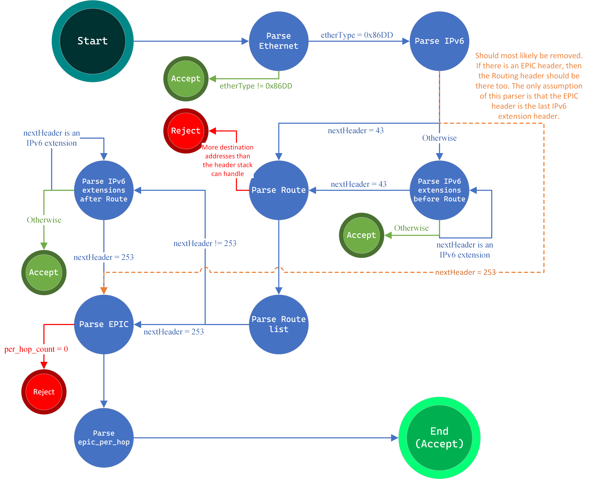

# EPIC-Authorization
This repository aims to implement the algorithms presented in *EPIC: Every Packet Is Checked in the Data Plane of a Path-Aware Internet*, a paper written by Markus Legner, Tobias Klenze, Marc Wyss, Christoph Sprenger, and Adrian Perrig, ETH Zurich that aims to increase security in the **data plane**. In particular, I will focus on ***L1: Improved Path Authorization***. This specification differs from the first implementation of *Path Authorization*, by replacing the *static hop authenticators* that were used in L0 with ***per-packet HVFs*** that will be computed with an *hop authenticator*. During path exploration, the AS calculates its hop authenticator $\sigma_{A}$ as follows:


$$
\sigma\_{A}^{(1)} = MAC\_{k\_{A}} (\text{TSpath} \| \text{HI}\_{A} \| S^{{(1) \backprime}} )
$$

$S^{{(1) \backprime}}$ is the segment identifier of the previous hop during path exploration, which is obtained by truncating the hop authenticator as follows:

$$
S(1) = \sigma^{(1)} [ 0 : l_{\text{seg}}]
$$

The hop authenticator is then used by the source host to calculate the per-packet HVFs like so:

$$
V\_{i}^{(1)} = MAC_{\sigma\_{i}^{(1)}} (\text{ts}\_{\text{pkt}} \| \text{SRC} ) [ 0 : l\_{\text{val}}]
$$


As the hop authenticators are not part of the packet header to limit communication overhead, the additional segment identifiers are required for chaining hops as they allow ASes to derive the hop authenticators on the fly. The aim of EPIC L1 is improving path authorization; in fact the field $V_{SD}$ is not used. An attacker trying to forge an authorized path needs to find at least one HVF by sending a large number of **probing packets**. In contrast to L0 however, this HVF cannot be used to send additional packets, which carry different timestamps. However, an attacker could still launch a DoS attack by replaying packets or resuing the packet timestamp. The other algorithms shown in the paper, such as L2 and forward, employ a *replay-suppression* algorithm in border routers to prevent this security risk. In particular, ***authentication*** is implemented in the following algorithms, which is not the scope of this repository. This is the reason why I've chosen to implement L1, the most secure algorithm that handles authentication.

## IPv6 extensions:
The supported IPv6 extension are the following:
- IPv6 Route: with nextheader value 43,
- EPIC: with nextheader value 253, used as testing value.

The recommended order for IPv6 extensions is the following:


| Order | Header Type | Next Header Code |
| ------| ----------- | ---------------- |
|   1   | Basic IPv6 Header |      -     |
|   2   | Hop-by-Hop Options |     0     |
|   3   | Destination Options (with Routing Options) |     60    |
|   4   | Routing Header |     43    |
|   5   | Fragment Header |     44    |
|   6   | Authentication Header |     51    |
|   7   | Encapsulation Security Payload Header |     50    |
|   8   | Destination Options |     60    |
|   9   | Mobility Header |    135    |
|       | No next header |     59    |
| Upper layer | Hop-by-Hop Options |     6     |
| Upper layer | Hop-by-Hop Options |     17    |
| Upper layer | Hop-by-Hop Options |     58    |

as defined by the IETF (Internet Engineering Task Force) in the following RFC standard [RFC 2460](https://datatracker.ietf.org/doc/html/rfc2460).

Regardless of the defined standard, I've decided to support any packet that didn't follow this order, with the only assumptions being that the `Routing Header` is located before the `EPIC header`. Given this requirement, I've defined two header stacks:
```p4
ipv6_ext_base_t[IPV6_EXTENSION_HEADER_SIZE] ipv6_ext_base_before_SR;
ipv6_ext_base_t[IPV6_EXTENSION_HEADER_SIZE] ipv6_ext_base_after_SR;
```

where the size can be chosen during compilation, (I've chosen 8 by default):
```C
#ifndef IPV6_EXTENSION_HEADER_SIZE
    #define IPV6_EXTENSION_HEADER_SIZE 8
#endif
```

The generic IPv6 extenion header is defined as the following:
```p4
// IPv6 extension header structure
header ipv6_ext_base_t {
    bit<8> nextHeader;
    bit<8> hdrExtLen;
    varbit<16320> data; // Maximum size is 255 octets => 8 * 255 = 2040 bytes = 16'320bits
}
```
The data is defined as a varbit since each extenion header can be of different sizes. I've chosen the size to be $16'320$ bits, since the maximum value of 1 byte is 255. Since the *hdrExtLen* express the amount of octets, the maximum value is $8 * 255 = 2040 \text{bytes} = 16'320 \text{bits}$.

### IPv6 extension parsing
The parsing is done as the following:
```p4
    state parse_ipv6_ext_chain_before_SR {
        ipv6_ext_base_t temp;
        packet.extract(temp, 16);

        // Extract variable size                                          Removing the 2 bytes already extracted
        bit<32> len = ((bit<32>) (temp.hdrExtLen + 1) * 8) - 2;
        packet.extract(temp, len * 8);

        hdr.ipv6_ext_base_before_SR[meta.ext_idx] = temp;
        hdr.ipv6_ext_base_before_SR[meta.ext_idx].setValid();

        meta.ext_idx = meta.ext_idx + 1;

        transition select(temp.nextHeader) {
            HOPOPT: parse_ipv6_ext_chain_before_SR;
            IPV6_ROUTE: parse_route;
            IPV6_FRAG: parse_ipv6_ext_chain_before_SR;
            ESP: parse_ipv6_ext_chain_before_SR;
            AH: parse_ipv6_ext_chain_before_SR;
            IPV6_OPTS: parse_ipv6_ext_chain_before_SR;
            MOBILITY_HEADER: parse_ipv6_ext_chain_before_SR;
            HIP: parse_ipv6_ext_chain_before_SR;
            SHIM6: parse_ipv6_ext_chain_before_SR;
            BIT_EMU: parse_ipv6_ext_chain_before_SR;

            // parse epic
            EPIC: parse_epic;

            default: accept;
        }
    }
```

A header in the current state is defined *temp*, the first 16 bits are extracted since they define the next header and the header size, common in all header extenion. Then, the header size is used to calculate then length of the rest of the header and extract it. Then, *temp* is added to the header stack and set valid. Since this are the headers that appear before the routing header, any other header will still enter this state, until the route is parsed. After the route header is parsed, the modified state 
https://github.com/filwastaken/EPIC-Authorization/blob/3cbe6886784691a5e1d2b64ced20eb757151c2d1/shared/authorization.p4#L203-L232

which is essentially the same, execpt the *temp* header is saved in the second header stack:
```p4c
hdr.ipv6_ext_base_after_SR[meta.ext_idx] = temp;
hdr.ipv6_ext_base_after_SR[meta.ext_idx].setValid();
```
### IPv6 extensions deparsing
```p4
apply {
  ...

  // IPv6 extension headers
  packet.emit(hdr.ipv6_ext_base_before_SR);

  // Route header
  ...

  // IPv6 extension headers
  packet.emit(hdr.ipv6_ext_base_after_SR);

  ...
}
```

This logic emits every IPv6 extension header before the segment routing header, then every IPv6 extension header after. In p4, `packet.emit` automatically emits only the valid entries in an header stack.

## Routing header
The routing header is defined as the following:
```p4
// Routing extension header
header route_base_t {
    bit<8>  nextHeader;
    bit<8>  headerLength;   // Length in 8-octet units, minus first 8 octets
    bit<8>  routingType;
    bit<8>  segmentsLeft;   // Index (0..N-1) of the next segment to process
    bit<8>   last_entry;
    bit<8>   flags;
    bit<16>  tag;
}

header route_segment_list_entry_t {
    bit<128> address;
}
```

I've divided the fixed part of the extension so that the list of addresses that will be defined in the header can be parsed into an header stack. In particular, I defined the header stack size so that it can be changed via compiler options:
```C
#ifndef IPV6_EXTENSION_HEADER_SIZE
    #define IPV6_EXTENSION_HEADER_SIZE 8
#endif
```

and the header stack as the following:

```p4
route_base_t route_header;
route_segment_list_entry_t[MAX_SRV6_SEGMENTS] segment_list;
```

### Parsing the routing header
To parse the routing header, I've defined to states where the first called [parse_route](/shared/authorization.p4#150) handles the fixed part of the header (namely, [route_base_t](/shared/authorization.p4#64), and the second called [parse_route_list](/shared/authorization.p4#160) parses into the header stack. Most importantly, in the `parse_route` state, I do the following check:

```p4
state parse_route {
  ...

  transition select((hdr.route_jeader.headlerLength / 128) > MAX_SRV6_SEGMENTS) {
    true: reject;
    false: parse_route_list;
  }
}
```

This manages the case where more destinations have been implemented in the routing header than the program can handle (which is directly related ton the size of the header stack). Furthermore, the state `parse_route_list` is defined as the following:

```p4
state parse_route_list {
  packet.extract(hdr.segment_list, (bit<32>) (hdr.route_header.headerLength / 2));

  meta.segment_list_count = hdr.segment_list.lastIndex() + 1;
  meta.ext_idx = 0;

  transition select(hdr.route_header.nextHeader){
    EPIC: parse_epic;
    default: parse_ipv6_ext_chain_after_SR;
  }
}
```

* The `packet.extract` function automatically saves the addresses into the header stack,
* The `meta.segment_list_count` is used to calculate the number of provided destination list, needed for the routing action in the ingress control block,
* The `meta.ext_idx` assignment is used for [IPv6 parsing](#ipv6-extension-parsing) to reset the index of the header stack and re-use it, saving space.

### Routing ingress processing
The match-action table for the routing header is defined as the following:
```p4
    // Routing table
    table routing_forwarding {
        key = {
            hdr.ipv6.dstAddr: exact;
        }

        actions = {
            nextDestination;
            NoAction;
        }

        default_action = NoAction();
    }
```
By default, every switch should have an entry for every direct neighbor such that the IP address of the neighbor should trigger the ***nextDestination*** action, which is defined as the following:
```p4
action nextDestination() {
  bit<8> index = meta.segment_list_count - hdr.route_header.segmentsLeft;
  hdr.ipv6.dstAddr = hdr.segment_list[index].address;
  hdr.route_header.segmentsLeft = hdr.route_header.segmentsLeft - 1;
}
```
This action will get the next address from the segments and swap it with the destination of the IPv6 header. Consider that the destination port will still sent the packet towards the destination before the swap since the ipv6 forwarding applies before the routing action. The apply block that triggers the table for the routing header is the following:
```p4
apply {
  // Packet forwarding
  if(hdr.ipv6.isValid()) {
    ipv6_forwarding.apply();


    if(hdr.route_header.isValid() && hdr.route_header.segmentsLeft > 0) {
      routing_forwarding.apply();
    }
  }

  ...
}
```

where the IPv6 forwarding table is applied to assign the correct output port to the packet, then the route header is applied if and only if the header is valid and there are segments left to re-route the packet to. This last check is done to speed up the match-action processing of a packet. By checking here if there are segments left instead of in the action, the switch will completly skip the match, therefore saving some clock cycles, which are very important in packet processing considering how fast they need to be handled and forwarded for high speed connections.

### Routing deparser
There is not much to discuss about the deparser, which is the following:
```p4
// Route header
packet.emit(hdr.route_header);
packet.emit(hdr.segment_list);
```

first, the static part of the header is emitted, then the header stack is emitted just as the IPv6 extensions header stacks.

## EPIC header
The EPIC header is defined as the following:

```p4
// EPIC Header
header epicl1_t {
    bit<32> path_ts;
    bit<64> src_as_host;
    bit<64> packet_ts;

    bit<8> per_hop_count;       // Used to loop (with recursion) over the hop validations 
    bit<8> nextHeader;          // Added nextHeader to the paper implementation
    // destination validation is unused in l1
}

header epicl1_per_hop_t {
    bit<24> hop_validation;
    bit<16> segment_id;
}
```

where I've separated the portion that is found only once in the packet, `epicl1_t`, with the information that is present as many times as the ASes the packet will traverse, `epicl1_per_hop_t`. Differently from the paper, I've added the `nextHeader` value in `epicl1_t`, which is needed to allow this techonology to integrate as an IPv6 extension header.

### EPIC header parsing
I have defined three headers related to EPIC that will be populated during parsing. They are:

```p4
epicl1_t epic;
epicl1_per_hop_t epic_per_hop_1;
epicl1_per_hop_t epic_per_hop_2;
```

Furthermore, the states used related to EPIC are the following:

```p4
state parse_epic {
  packet.extract(hdr.epic);
  transition parse_first_epic_hop;

  /* I don't think this is necessary
  transition select(hdr.epic.per_hop_count){
    0: reject; // It doesn't make sense! As long as the epic header is valid, there must be an per_hop header
    default: parse_first_epic_hop;
  }*/
  }

state parse_first_epic_hop {
  packet.extract(hdr.epic_per_hop_1);
  transition select(hdr.epic.per_hop_count){
    1: layer_4_transition;
    default: parse_second_epic_hop; // hop_count > 1
  }
}
```

### EPIC header processing
At the end of the apply section, if the epic header is valid, the `epic_authorization` table is applied.
```p4
apply {
  ...

  if(hdr.epic.isValid()) {
    // TODO: Implement this correctly via the extern function
    // meta.calculated_mac = calculate_mac(parameters)

    epic_authorization.apply();

    /*
     * Modifying the epic header to save on space
     */

    // Once it's been authorized, the first per-hop header can be removed
    hdr.epic_per_hop.setInvalid();

    // This was the last 
    if(hdr.epic.per_hop_count > 1) {
      hdr.epic.per_hop_count = hdr.epic.per_hop_count - 1;
    } else {
      if(hdr.ipv6.nextHeader == EPIC) {
        hdr.ipv6.nextHeader = hdr.epic.nextHeader;
      } else {
        hdr.ipv6_ext_base_after_SR[meta.ext_idx].nextHeader = hdr.epic.nextHeader;
      }

      hdr.epic.setInvalid();
    }
  }
}
```

The EPIC authorization table is used to check the validity of the passed HVF for this particular packet. In particular, the MAC is calculated via the following extern function:

```C
\\ NOT DONE YET
```

which is saved into the metadata value `calculated_mac`, defined as:
```p4
bit<24> calculated_mac;
```

This is then used as the exact key to compare the calculated mac to the one *passed by the control plane*, which will add it inside the defined table with the associated action `NoAction`. This will make every packet that have a correct MAC pass, all the others will be dropped.

```p4
table epic_authorization {
  key = {
      meta.calculated_mac: exact;
  }
  actions = {
      NoAction;
      drop;
  }
  size = 1024;
  default_action = drop();
}
```

Let's now discuss the section that follows in the apply block:
#### Modifying the epic header to save on space
The core idea to save on space is that the per-hop information of the epic header is useful only for a single hop, therefore once one of those information is used, it can be discarded since it will never be used again! I will write again that part of the code for better viewing:

```p4
/*
* Modifying the epic header to save on space
*/

// Once it's been authorized, the first per-hop header can be removed
hdr.epic_per_hop.setInvalid();

// This was the last 
if(hdr.epic.per_hop_count > 1) {
  hdr.epic.per_hop_count = hdr.epic.per_hop_count - 1;
} else {
  if(hdr.ipv6.nextHeader == EPIC) {
    hdr.ipv6.nextHeader = hdr.epic.nextHeader;
  } else if(meta.ext_idx == 0) {
    hdr.route_header.nextHeader = hdr.epic.nextHeader;
  } else {
    hdr.ipv6_ext_base_after_SR[meta.ext_idx].nextHeader = hdr.epic.nextHeader;
  }

  hdr.epic.setInvalid();
}
```

As I was mentioning above, the first action that can be taking is invalidating the first per-hop header, since it has already been used by this border router and can be skipped in the deparser. Since the EPIC header shrinks in since the more the packet moves through ASes, I need to handle the case where the packet has reached the last AS or it's still traveling through. In particular, if it needs to go through more than 1 AS, I need to reduce the per_hop_count information to reflect the first per_hop invalidation. Otherwise, if this is the last, I need to remove the EPIC header extension as well! To do this, I first need to change the last IPv6 extension next header with the one that follows EPIC. To apply this change, I need to know which is the header that precedes the EPIC header. Considering the parser I've created, it can either be the IPv6 header, the Routing header extension or the last header extension AFTER the Segment Routing header, since the assumption is that the EPIC header can never be found before the Routing header. After the change is complete, the epic header is set to be invalid.

NOTE: Considering recent changes in the parser and the deparser, I might be able to drop the assumption that EPIC must appear after the Routing header. In case it were true, the parser would require *some* changes in the IPv6 extension header stacks.

### EPIC header deparser
The final part of the deparser apply block is the following:

```p4
/*
 * The `epic_per_hop` header is never emitted since, once it's used, it will never be used by the subsenquent routers and
 * not emitting it will save space/time, especially for fast connections.
*/

packet.emit(hdr.epic);
```

## Conclusion on the parser
The final Mealy machine grpah implemented as the parser is the following:



# Project Issues
At the moment is not compiling because the last index in line 204 is a 32 bit value that I need to truncate. This is a minor problem that I can solve later, it (should) be logically correct
